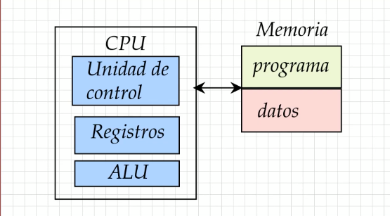

# Arquitectura de cómputo

La forma en que los componentes de una computadora se interconectan entre si.

## Arquitectura Hardvard

Contamos con una CPU que tiene la unidad de control, registros y ALU. A la vez contamos con dos memorias, una para almacenar datos y la otra para almacenar el programa ejecutable.

Este tipo de arquitecturas es bastante popular en los sistemas embebidos, como arduino o los PICs (microcontroladores de Microchip).

La ventaja de esta arquitectura es que podemos trabajar en paralelo, de tal manera que la CPU puede cargar la siguiente instrucción ejecutarla en el programa y al mismo tiempo leer o escribir datos. Esto nos permite un paralelismo en ejecución.

También nos permite manejar un distinto tamaño en cada memoria de tal modo que cada una de las memorias puede tener una cantidad de bits distintas al ancho.

Plantea unos ciertas desventajas como: cuál es la dirección de memoria a leer sino también cuál es la a qué clase de momoria va a corresponder. A simple vista parece que solo se va a utilizar la memoria de datos, pero hay situaciones muy concretas donde no necesarieamente se puede dar ese caso.

## Arquitectura Von Neumann

Esta arquitectura es la más utilizada a día de hoy, es en la que se basan la mayoría de ordenadores y es la más usada en PC, consolas, tabletas y teléfonos móviles.

Contamos con la separación de la memoria a nivel lógico y ya no a nivel físico como lo teníamos en la arquitectura Hardvard. Las primeras filas están destinadas a almacenar el programa y el resto a almacenar datos, o también podemos tener secciones o bloques para cada propósito.

En este tipo de arquitectura tendremos el llamado _"cuello de botella"_ entre la comunicación del CPU con la memoria, esto quiere decir que un momento determinado en el tiempo cualquiera que este sea solo se va a poder leer o escribir un dato del programa, o de los datos. Por lo tanto no puedo leer o escribir ambos al mismo tiempo, tengo que esperar a que uno de esos procesos termine para poder continuar.

Este tipo de arquitectura también puede tener ventajas como que ahora se tenga una sola memoria, de esta manera ya no se debe consumir recursos para mantener dos memorias distintas. Ahora los datos estarán colocados de alguna forma inexacta en cuanto al tamaño de palabra o al número de bits que conforman una fila de esta memoria, por lo tanto va a haber casos donde los datos necesiten más de una fila o la longitud de una instrucción ocupe más de una fila, habrá momentos muertos donde la memoria tendrá bloques sin utilizar y la manera en la que se utiliza la memoria va a recurria a ciertos tipos de algoritmos para que la memoria se pueda ordenar de la mejor manera posible y estos datos violan o sobreescriben los datos de otros programas.

## Arquitectura Hardvard Modificada

Trata de solventar las desventajas encontradas en las dos arquitecturas anteriores. Usadas en los procesadores de Intel o AMD modernos.

Esta arquitectura nos habla de distintos niveles de caché: L1, L2, L3. Por lo tanto, hace referencia a estas caché, las cuales son memorias muy pequeñas que almacenan datos o directamente instrucciones. Antes de consultar la memoria, primero consulta sus niveles de caché de datos y programas.

La capacidad de almacenamiento en la caché es limitada, la cantidad de datos L1 será menor que en la caché L2 y asimismo en la caché L3. Hay que tener en cuenta que la caché L1 será la única que se dividirá en dos memorias. Si no existe el dato en la memoria caché entonces ahí irá a buscar los datos en la memoria.

## Clasificación de los procesadores

| Familia   | Hardvard             | Von Neumann |
| --------- | -------------------- | ----------- |
| x86(CISC) |                      | INTEL / AMD |
| avr(RISC) | ATmega328p (arduino) |             |
| PIC(RISC) | PIC16F84A            |             |
| arm(RISC) |                      | QUALCOMM    |
| etc       |                      |             |

Cada uno de estos procesadores tendrá un ensamblador distinto
