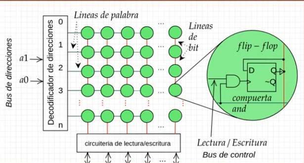
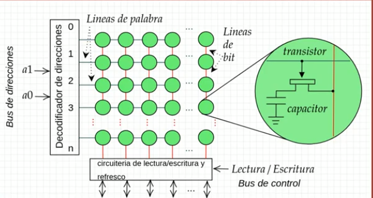

# Componentes básicos

## 1. CPU

[Imagen CPU](../docs/images/cpu.png)

### ALU (Unidad aritmética lógica)

- Prácticamente es el corazón de una CPU.
- Abarca el multiplexor.

#### CISC

Grupo complejo de instrucciones para computadoras. Lo usan procesadores del grupo x86 mayormente, dentro de esta familia están los procesadores Intel y AMD. Hace muchas más tareas por debajo. Electrónica más compleja.

```
multiplica a,b
```

#### RISK

Grupo reducido de instrucciones para computadoras. Usados por procesadores de tipo ARM, aquí hablamos de Qualcomm, Samsung, etc. Menos cantidad de componentes electrónicos.

```
cargar a
cargar b
multiplica a,b
guardar a
```

### Unidad de control

Sirve para sincronizar la complejidad de las instrucciones.

### Registros

Las memorias RAM almacenan información pero para la velocidad a la que trabaja el procesador estas pueden ser algo lentas. Para solventar este detalle, se contruye esta unidad de memoria llamados registros que permitan almacenar información dentro del procesador y que sean extremadamente rápidos.

Espacios de memoria dentro del procesador. Para que el procesador no dependa únicamente de la memoria RAM. Van a ser una especie de flip flop.

## 2. Entrada/Salida

El procesador va a tener que ir por los datos a la memoria RAM, o va a leer los datos que queremos introducir.

Esta unidad es importante para que el procesador reciba datos y envíe datos.

Permite comunicar nuestros periféricos para nuestro computador.

**Bus: Conjunto de elementos físicos que nos permiten interconectar elementos electrónicos entre sí.**

- Bus de control: Decirle a un dispositivo si va a leer o escribir.
- Bus de datos: Conducen datos en crudo que vamos a estar leyendo.
- Bus de direcciones: Permite seleccionar un determinado dispositivo.

## 3. Memoria principal

Cada elemento de la fila almacena 1 bit de datos.

### Tipos de memoria

RAM: Random Access Memory

#### SRAM



Los registros pueden ir desde los 8 bits o 8 flip-flops alineados hasta un máximo de 64 bits.

Las memorias de tipo RAM son utilizadas en las cachés. No solo en las cachés de los procesadores: disco duro, tarjeta de red, etc.

#### DRAM



Memoria de acceso aleatorio dinámica

En lugar de usar un flip-flop se usa solamente un capacitor y un transistor. Este mecanismo no necesita una gran capacidad energética.
